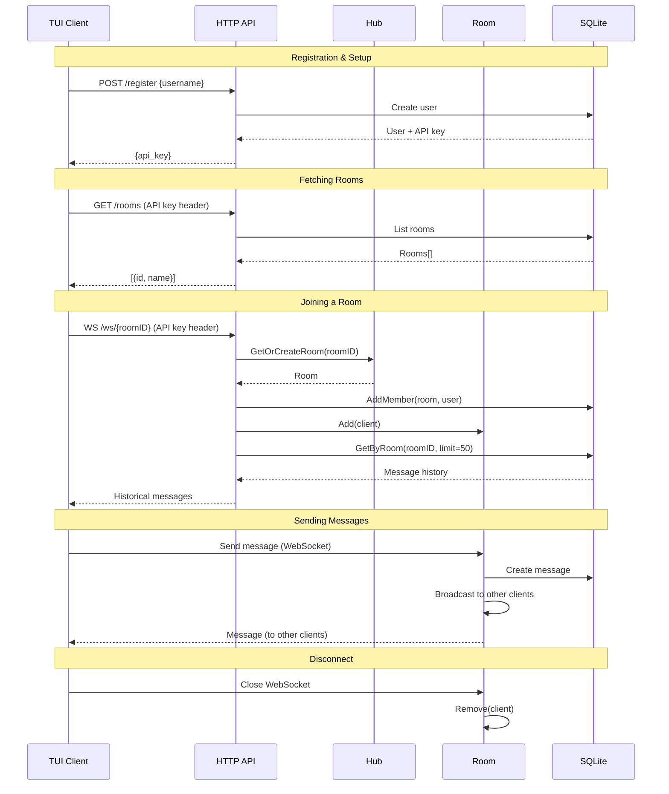

# Architecture

## Client-Server Data Flow

## Components

| Component | Location | Description |
|-----------|----------|-------------|
| TUI Client | `internal/client/ui/` | Bubble Tea terminal UI |
| HTTP API | `internal/server/api/` | Chi router with REST + WebSocket endpoints |
| Hub | `internal/server/hub/hub.go` | Manages all rooms, thread-safe |
| Room | `internal/server/hub/room.go` | Manages clients in a room, broadcasts messages |
| Client | `internal/server/hub/client.go` | WebSocket read/write pumps per connection |
| SQLite | `internal/repository/` | GORM-based persistence layer |
