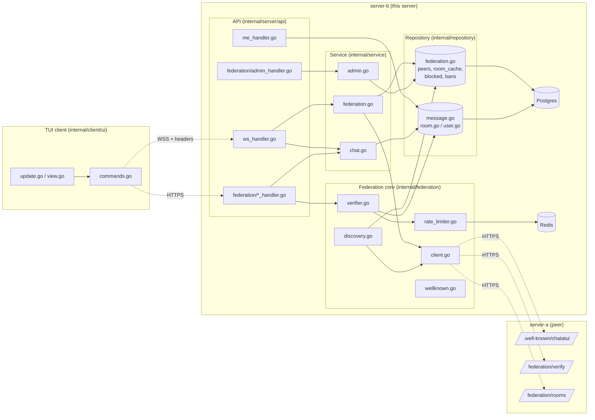
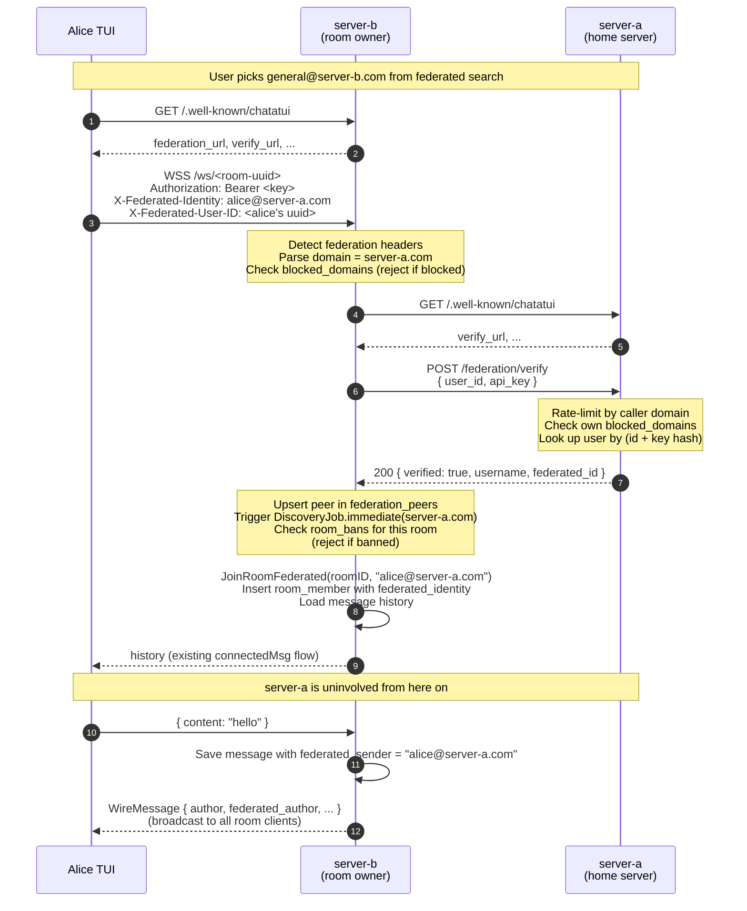
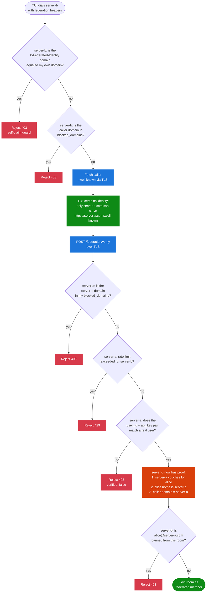
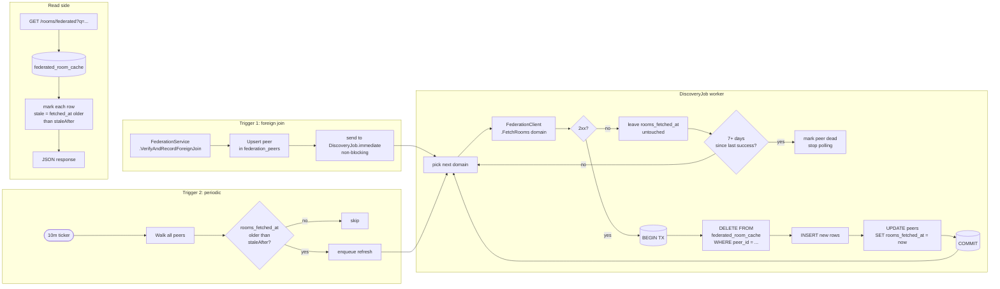
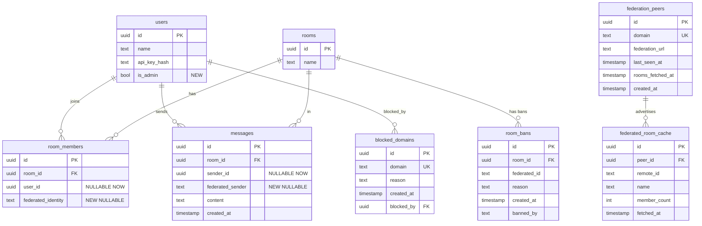
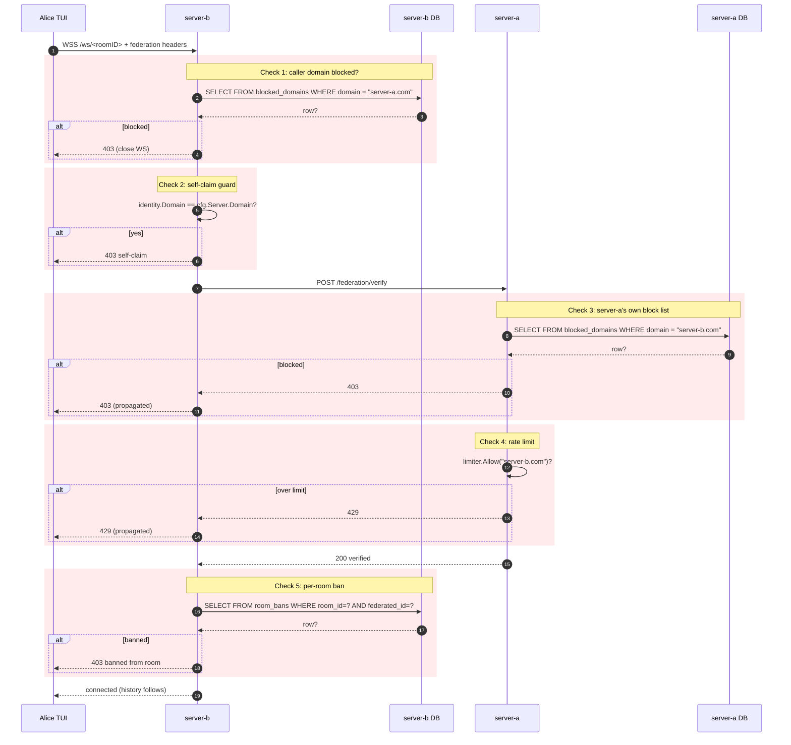

# Federation Design

Visual reference for the federated chat network described in the federation epic (#81). Each diagram targets one mental model — read whichever helps the question you're holding.

> Companion to: the federation PRD (Goals / Non-goals / API shape live there). This file shows *how the pieces move*, not *what they are*.

---

## 1. Component / package map

Where the new code lives and which packages depend on which. Solid arrows are direct calls; dashed arrows are HTTP across a network boundary.



**Reading guide.** `FederationService` is the orchestrator on the inbound side; `FederationClient` + `DiscoveryJob` are the outbound side. The two never talk directly — they share state through repositories.

---

## 2. Cross-server join sequence

The 10-step join from the PRD, drawn out. Three actors — Alice's TUI, server-b (room owner), server-a (Alice's home server).



**Watch points.** Steps 4 and 7 are the only network hops between server-b and server-a; once verification returns, server-a is out of the picture for the lifetime of Alice's connection.

---

## 3. Trust & verification flow

What each side knows, trusts, and proves. Useful when reasoning about attacks ("can server-x impersonate alice?") or about why a step exists.



**The trust pillar.** v1 has no request signing — TLS certificate validation is the entire trust mechanism. A claim "I am server-a.com" is only believed because we contacted `https://server-a.com/...` and the cert chain checked out.

---

## 4. Discovery feedback loop

How the federated room cache stays warm. The interesting part is the **immediate** path that fires whenever a foreign user joins for the first time.



**Why full-replace.** A peer's room list isn't authoritative anywhere in our DB — losing one entry between fetches is fine, double-counting is annoying. Full-replace inside one transaction trades a tiny window of "no rooms cached for peer X" for a much simpler invariant.

---

## 5. Data model

New tables (green) and modified existing tables (yellow). Only fields relevant to federation are shown.



**Invariants worth holding in your head.**

- `room_members`: exactly one of `(user_id, federated_identity)` is non-null. Enforced by raw SQL since GORM can't express it.
- `messages`: same — exactly one of `(sender_id, federated_sender)` is non-null.
- `federated_room_cache.remote_id` is a string (the room UUID *on the remote server*), not a local FK. Local rooms and remote rooms never collide.
- Unique on `(peer_id, remote_id)` so re-fetching is idempotent.
- Unique on `(room_id, federated_id)` so bans can't double up.

---

## 6. Moderation enforcement points

Every place a block or ban is checked along the federated join path. Useful as a checklist when implementing or auditing #77.



**Five chokepoints, two databases, both directions.** Checks 1, 2, and 5 live in server-b's WS join path; checks 3 and 4 live inside server-a's `/federation/verify`. None of these checks should ever be skipped — even though check 3 looks redundant with check 1, they're mirror images and either side may have unique reasons to block.

---

## How to update these diagrams

GitHub renders Mermaid natively, so previews work in PRs. For local rendering during edits:

```bash
# Option 1: use the GitHub preview when pushing.
# Option 2: install mermaid-cli and render to PNG.
npx --yes @mermaid-js/mermaid-cli -i docs/federation-design.md -o /tmp/diagram.png
```

Keep changes diagram-by-diagram — small commits per section make review and rollback easier.
